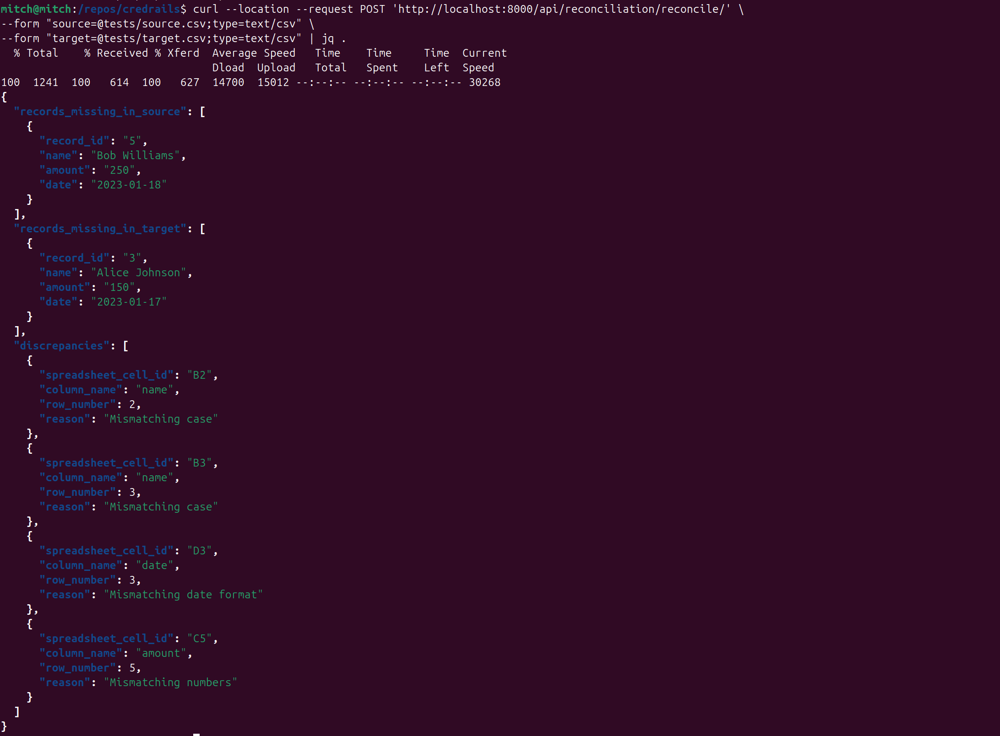

# Credrails

[](https://github.com/ajharry69/credrails/actions/workflows/pipeline.yml)
[](https://www.python.org/downloads/)
[](https://www.djangoproject.com/download/)
[](https://www.django-rest-framework.org/)

The application provides REST API that reconciles two provided CSV files — a `source` and a `target` — and generates a
report detailing any discrepancies found. The report categorises discrepancies as:

1. Records present in the `target` CSV but missing from the `source` CSV.
2. Records present in the `source` CSV but missing from the `target` CSV.
3. Specific differences in records that exist in both the `source` and `target` CSVs.

### Running with Docker

To run this project using Docker, follow the steps below:

#### Prerequisites

Ensure you have Docker and Docker Compose installed on your system. Refer to
the [Docker installation guide](https://docs.docker.com/get-docker/) for assistance.

#### Build and Run the Application

Build the Docker images and start the services:

```bash
docker compose up --build
```

#### Run automated tests

```bash
docker compose exec app py.test .
```

### Running with Manual Installation

#### Prerequisites

The following guidelines assume presence of an active python virtual environment. In the absence of virtual
environment, please visit [here](https://fastapi.tiangolo.com/virtual-environments/#create-a-project) to set one up.

#### Install dependencies

```bash
pip install --upgrade --upgrade-strategy=eager pip
pip install --upgrade --upgrade-strategy=eager -r requirements-dev.txt
```

#### Start server

```bash
DJANGO_MODE=DEVELOPMENT python manage.py runserver
```

#### Run automated tests

```bash
py.test .
```

### Accessing the application

1. From a browser at http://localhost:8000/api/reconciliation/reconcile/.
2. Using [curl](https://curl.se/):

   ```bash
   curl --location --request POST 'http://localhost:8000/api/reconciliation/reconcile/' \
   --form "source=@tests/source.csv;type=text/csv" \
   --form "target=@tests/target.csv;type=text/csv" | jq .
   ```


